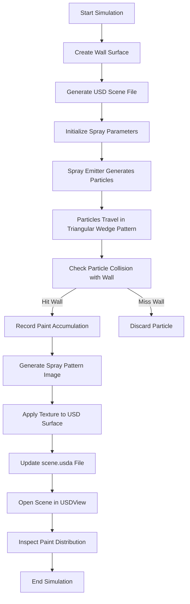

# Spray Paint Simulation using OpenUSD

**Project Overview**
This project simulates a spray painting process on a surface using OpenUSD. The spray emitter produces a triangular wedge (fan) pattern, similar to real industrial paint spray guns. The simulation generates paint particles that interact with a surface (a cuboid wall mesh) and records the paint accumulation on the surface. The resulting USD scene can be visualized using Pixar USDView, allowing inspection of the spray pattern and paint distribution.

--------------------This repository is currently under development and does not represent the final completed version of the project------------------

# Simulation Workflow


# Installation
1. Clone the repository (Alternatively you can download this repository and work run it locally on vscode)
```bash
git clone https://github.com/adityaanirudhk/spray_paint_usd_project.git
cd spray_paint_usd_project
```

3. Install dependencies
Ensure Python 3.10+ is installed.
Install required libraries:
```bash
pip install numpy matplotlib usd-core
```

Verify the installation of OpenUSD:
```bash
python -c "from pxr import Usd;print(Usd.GetVersion())"
```

## Requirements
```bash
pip install usd-core numpy pillow
```

To inspect results:
```bash
usdview scene.usda
```

## Steps

1. Create wall (This will create a .usda file indicating that the wall has been created successfully)
```bash
python create_wall.py
```

3. Run simulation (This code runs the simulation and generates images to view the results before moving to OpenUSD)
```bash
python run_simulation.py
```

5. Update the same in the USD File
```bash
python apply_texture.py
```

3. Inspect scene in OpenUSD
```bash
usdview scene.usda
```

# Custom Simulation Parameters
| Parameter   | Description                 |
| ----------- | --------------------------- |
| `--width`   | Spray fan angle             |
| `--range`   | Maximum spray distance      |
| `--density` | Number of particles emitted |

# Confirming Paint Accumulation

Once the scene opens in Pixar USDView:
  1. Locate the wall surface in the Stage Tree
  2. Inspect the mesh properties
  3. Enable Display Color in the viewport
  4. Observe the triangular spray pattern on the surface

Correct simulation behavior should show:
  1. Higher paint accumulation near the center of the spray
  2. A triangular wedge distribution pattern
  3. Increasing paint density closer to the emitter axis


